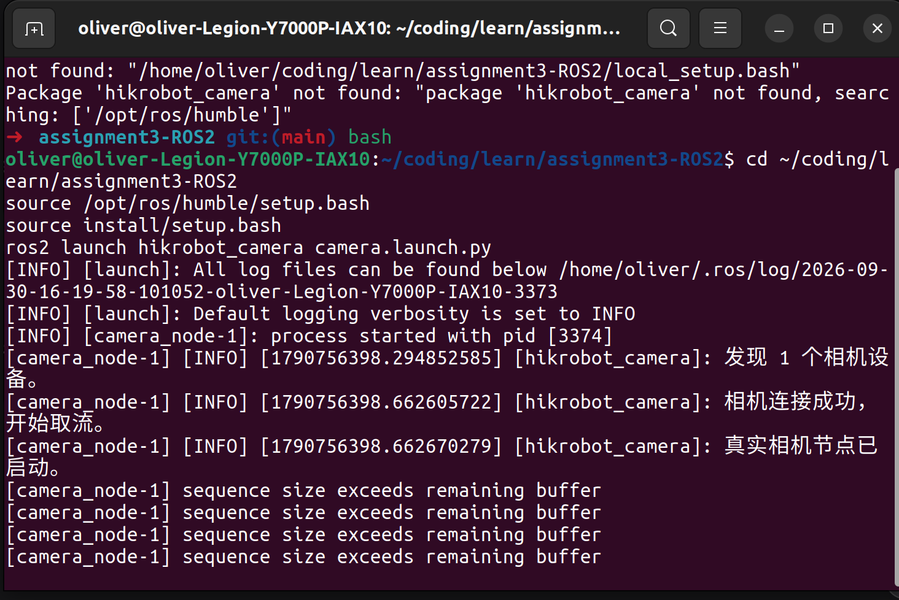
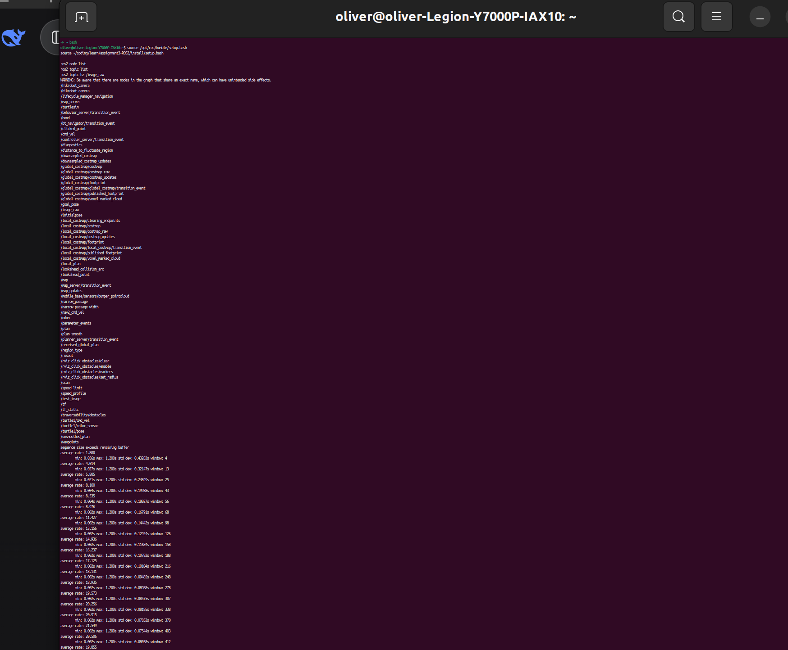
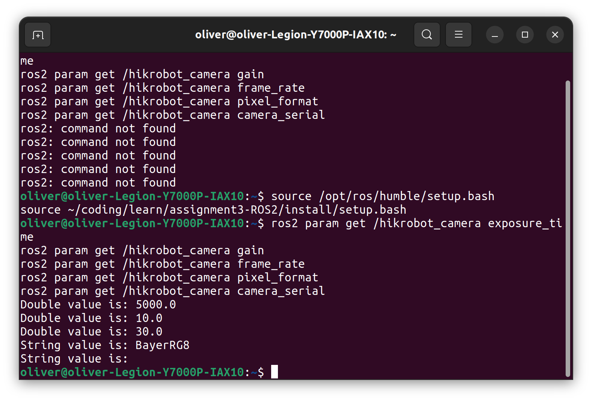
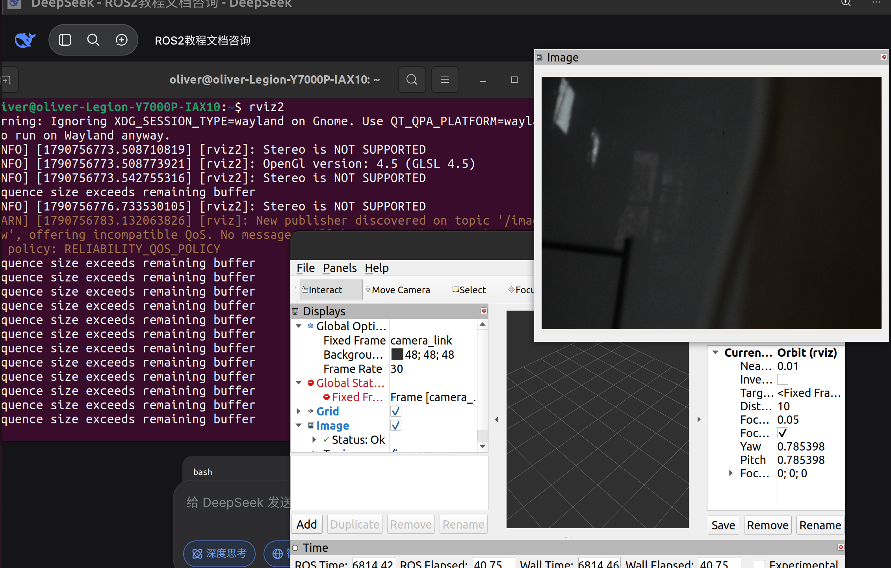
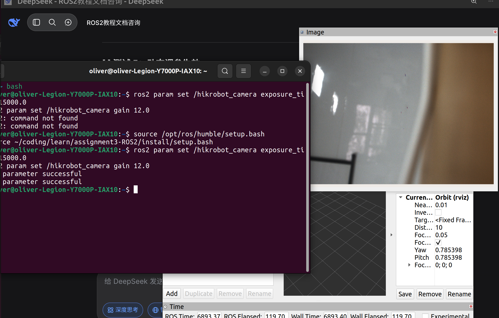
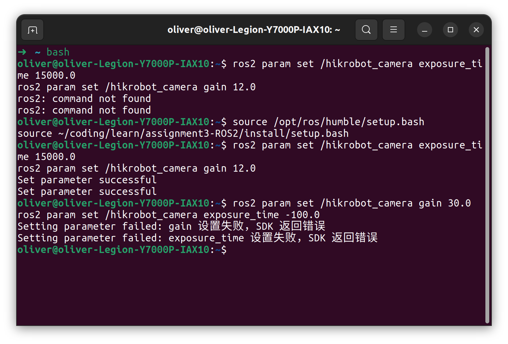
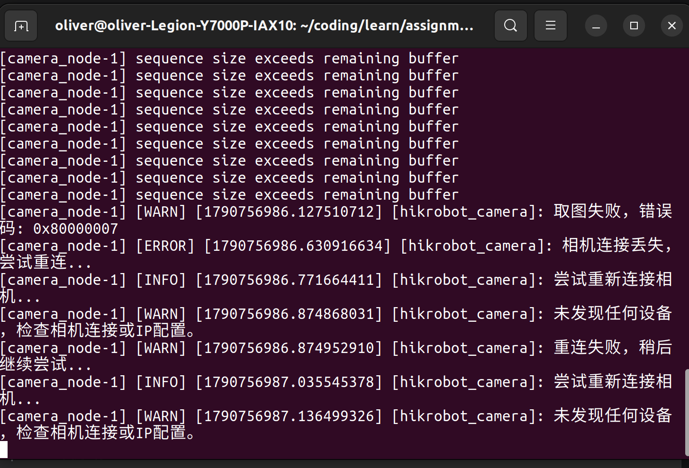
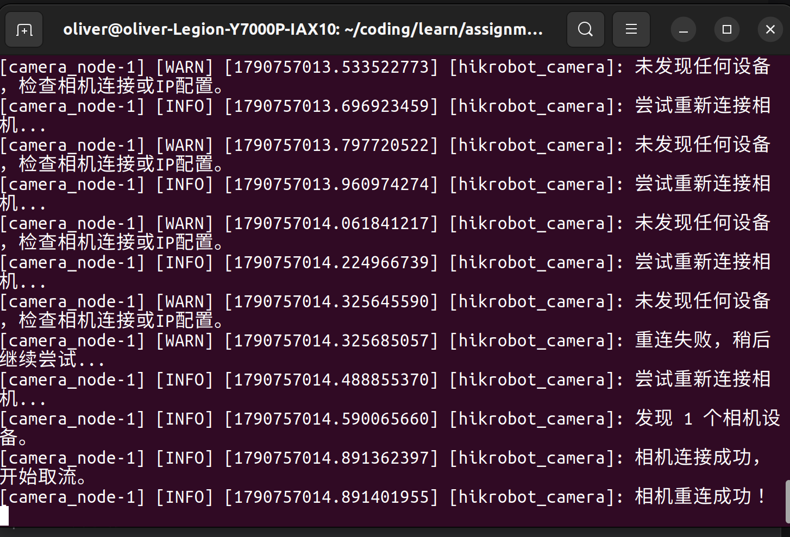
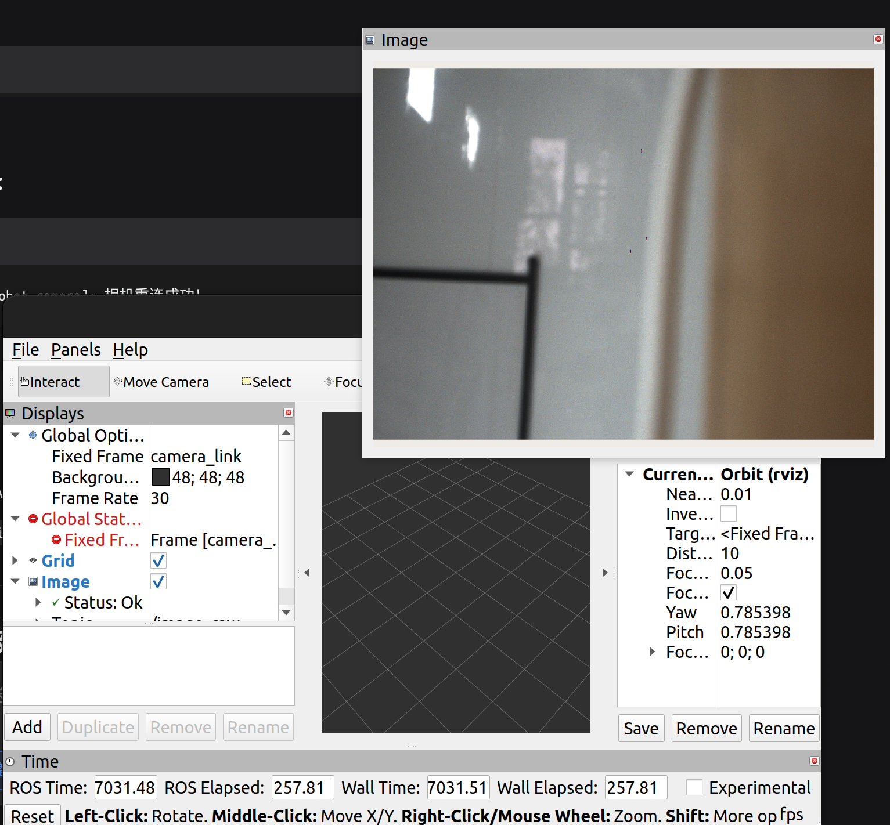

# Hikrobot Camera ROS 2 Driver

基于海康机器人 MVS SDK 封装的 ROS 2 Humble 相机驱动。

在 Ubuntu 22.04 / ROS 2 Humble 上，通过 ROS 2 节点封装海康 MVS SDK，实现工业相机图像采集、参数动态配置、断线自动重连等功能。

---

## 一、环境依赖

| 组件 | 版本 |
|------|------|
| 操作系统 | Ubuntu 22.04 |
| ROS 2 | Humble |
| 海康 MVS SDK | V5.1.0 (Linux x86_64) |
| 编译器 | GCC 支持 C++17 |

---

## 二、MVS SDK 安装（必须手动）

本功能包依赖海康官方 MVS SDK，**该 SDK 不在 ROS 2 的 rosdep 源中，无法通过 `rosdep install` 自动安装**，必须手动完成以下步骤：

1. 访问 [海康机器人下载中心](https://www.hikrobotics.com/cn/machinevision/service/download/)，下载 **MVS V5.1.0 (Linux x86_64)**。
2. 使用 `.deb` 包安装，或解压 `.tar.gz` 后执行 `sudo ./setup.sh`。
3. 默认安装路径为 `/opt/MVS`。
4. 安装完成后确认以下文件存在：

```bash
ls /opt/MVS/include/MvCameraControl.h
ls /opt/MVS/lib/64/libMvCameraControl.so
```

如果 SDK 安装在非默认路径，编译时通过 `-DMVS_ROOT=<路径>` 指定：

```bash
colcon build --symlink-install --packages-select hikrobot_camera \
  --cmake-args -DMVS_ROOT=/your/path/to/MVS
```

---

## 三、编译

```bash
source /opt/ros/humble/setup.bash
# 仅当系统尚未初始化 rosdep 时执行一次：sudo rosdep init
rosdep update
rosdep install --from-paths src --ignore-src -r -y --rosdistro humble
colcon build --symlink-install --packages-select hikrobot_camera
```

本仓库本身就是工作空间，不需要再放到另一个工作空间的 `src/` 中。

---

## 四、运行

```bash
source /opt/ros/humble/setup.bash
source install/setup.bash
ros2 launch hikrobot_camera camera.launch.py
```

也可以指定自定义的参数文件：

```bash
ros2 launch hikrobot_camera camera.launch.py params_file:=/absolute/path/to/camera.yaml
```

如使用 Zsh，将 `.bash` 替换为 `.zsh`。

---

## 五、话题

| 话题名 | 消息类型 | 说明 |
|--------|----------|------|
| `/image_raw` | `sensor_msgs/msg/Image` | 相机实时图像（rgb8 编码） |

在 RViz2 中查看：`Fixed Frame` 设为 `camera_link`，添加 `Image` 显示并选择 `/image_raw`。

---

## 六、可配置参数

| 参数名 | 类型 | 默认值 | 说明 |
|--------|------|--------|------|
| `camera_serial` | string | `""` | 相机序列号；留空表示连接第一个发现的相机 |
| `exposure_time` | double | 5000.0 | 曝光时间（微秒） |
| `gain` | double | 10.0 | 增益 |
| `frame_rate` | double | 30.0 | 目标帧率（Hz） |
| `pixel_format` | string | `"BayerRG8"` | 像素格式：`BayerRG8` / `RGB8` / `Mono8` |

参数位于 `config/camera.yaml`，可通过 launch 文件自动加载，也可在节点运行时动态修改：

```bash
ros2 param set /hikrobot_camera exposure_time 15000.0
ros2 param set /hikrobot_camera gain 12.0
ros2 param set /hikrobot_camera pixel_format "RGB8"
```

参数更新会先停止取流、设置完毕后再恢复取流（避免海康 SDK 报 `0x80000003`）。设置失败时，命令会返回明确的失败原因。

---

## 七、功能特性

- ✅ 按序列号自动发现并连接指定海康相机（GigE / USB3）
- ✅ 图像采集并通过 `/image_raw` 发布为 `sensor_msgs/msg/Image`
- ✅ Bayer → RGB8 像素格式转换
- ✅ 通过 ROS 2 参数机制动态配置曝光、增益、帧率、像素格式
- ✅ 手动模式自动关闭自动曝光 / 自动增益
- ✅ 参数越界或 SDK 报错时返回明确失败原因
- ✅ 断线自动重连，重连后自动恢复已配置参数
- ✅ 提供 launch 文件和 YAML 参数配置

---

## 八、已知问题

- 图像转换当前固定输出 `rgb8`，若相机设置为 `Mono8` 输入，可在 `pixel_format` 中切换，但下游消费端需要相应处理单通道数据。
- 单帧最大缓冲区按 1920×1200 分配，若使用更高分辨率相机需相应调整。

---

## 九、目录结构

```text
assignment3-ROS2/                   # 同时也是 colcon 工作空间
├── README.md
├── docs/
│   ├── ROS2Tutorial.md
│   ├── assignment.md
│   └── images/
│       ├── 01_launch_success.png
│       ├── 02_topic_hz.png
│       ├── 03_params_load.png
│       ├── 04_rviz2_image.png
│       ├── 05_param_set.png
│       ├── 05_rviz2_after_set.png
│       ├── 06_param_reject.png
│       ├── 07_disconnect.png
│       ├── 07_reconnect.png
│       └── 07_rviz2_recovered.png
└── src/hikrobot_camera/
    ├── package.xml
    ├── CMakeLists.txt
    ├── include/hikrobot_camera/
    │   └── camera_node.hpp
    ├── src/
    │   ├── main.cpp
    │   └── camera_node.cpp
    ├── launch/camera.launch.py
    └── config/camera.yaml
```
---

## 十、测试验证

以下为真实海康相机上的实测结果。

### 1. 节点启动与相机连接
**说明**：下图拍摄于修复缓冲区大小之前，终端底部的 `sequence size exceeds remaining buffer` 
警告在修复后已消失。

**修复方法**：将 `src/hikrobot_camera/src/camera_node.cpp` 中 `grab_and_publish()` 
里的两处缓冲区：
- `std::vector<unsigned char> raw_data(1920 * 1200 * 3);` → `(4096 * 3000 * 3)`
- `std::vector<unsigned char> rgb_data(1920 * 1200 * 3);` → `(4096 * 3000 * 3)`

**注**：截图中下方出现的 `sequence size exceeds remaining buffer` 警告，
> 是因为原始代码中单帧缓冲区按 1920×1200 分配，小于实际相机输出。
> 已通过将 `src/hikrobot_camera/src/camera_node.cpp` 中 `grab_and_publish()`
> 里的两处缓冲区改为 4096×3000×3 修复。该警告不影响功能，但会刷屏并降低帧率。

### 2. 话题与帧率



### 3. 参数从 YAML 加载



### 4. RViz2 显示实时画面



### 5. 动态调参



### 6. 越界参数被拦截



### 7. 断线重连

拔线后：



插线后恢复：



画面恢复：

